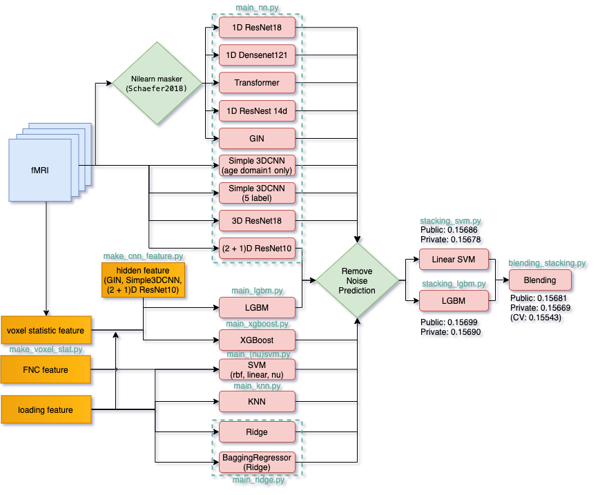

# kaggle-trends-3rd-place-solution
the 3rd place solution code of Kaggle TReNDS Neuroimaging (https://www.kaggle.com/c/trends-assessment-prediction/overview)


## Solution OverView


## Solution Details

Please read [this post](https://www.kaggle.com/c/trends-assessment-prediction/discussion/162934) on Kaggle Discussion.

## Hardware

I mainly use local machine with following spec.
```
OS: Ubuntu 18.04 LTS
CPU: Intel(R) Core(TM) i7-9700K CPU @ 3.60GHz
GPU: GeForce RTX 2080 x2
```
## Requirement

You should install docker-ce.
If you don't have docker installed, please refer to [this page](https://docs.docker.com/engine/install/debian/) to install it.


## How to use


### Data download

Plese download data to ./input from https://www.kaggle.com/c/trends-assessment-prediction/data and unzip it.

### build docker

```
$ docker build ./run_image/gpu -t kaggle/pytorch:trends
```

### preprocess

- compute statistic features of voxel and adjacency matrix of components from fnc data.

```
$ sh bin/preprocess.sh
```

### train model and make prediction of test data

I used [Weight & Biases](https://www.wandb.com/) for management of experiments and Google Cloud Storage for saving result. If you want to use this function, please set `yamls/store/*.yaml` as below.

```
  wandb_project: [your wandb project name]
  gcs_project: [your gcp project name]
  bucket_name: [your gcs bucket name]
```

1. Train NN models

    ```
    $ sh bin/train_nn.sh
    ```

2. make_cnn_feature

    ```
    $ sh bin/make_cnn_feature.sh
    ```

3. train simple models

    ```
    $ sh bin/train_simple_models.sh
    ```

### stacking

```
$ sh bin/stacking_lgbm.sh && sh bin/stacking_svm.sh
```

### blending stacking

```
$ sh bin/blending_stacking.sh
```

The final output is generated in `./output/blending_lgbm_svm_stacking.csv`.